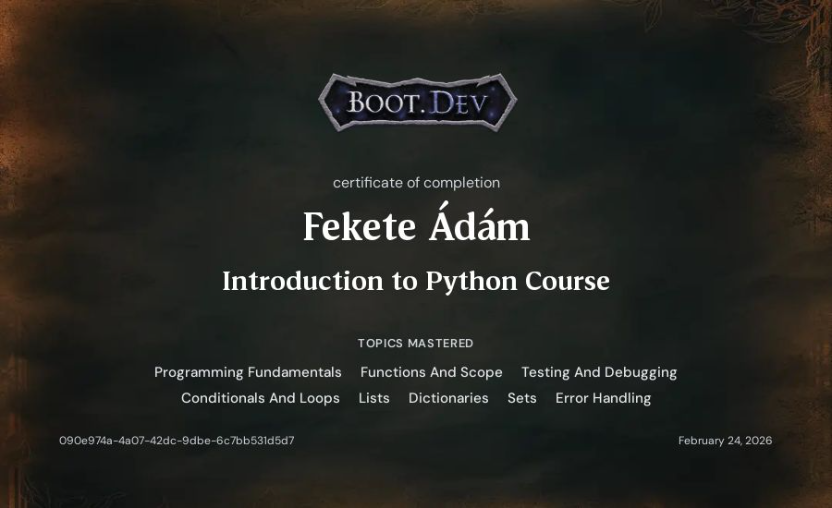
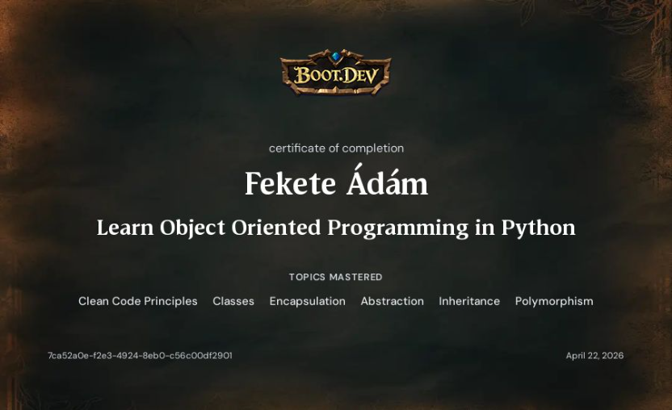
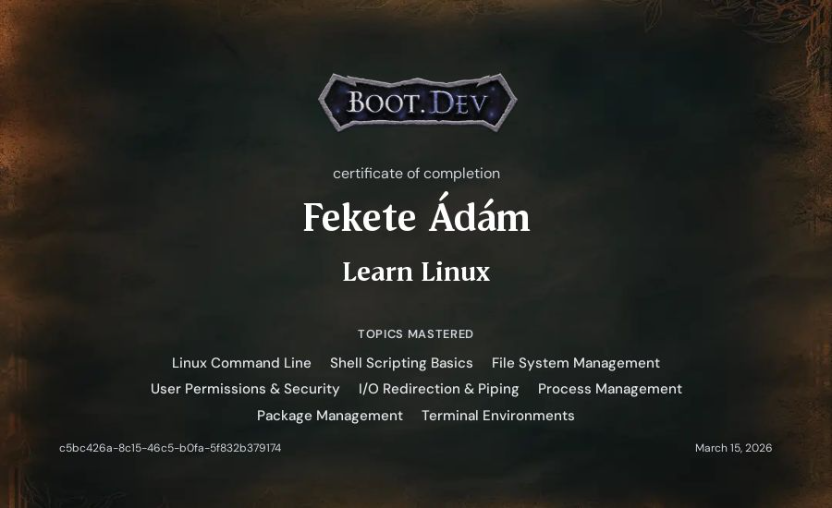
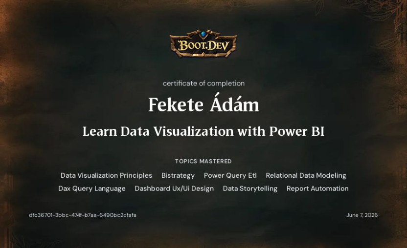

# Certifications

This repository contains certificates from completed online courses and professional development programs.

## Boot.dev

### Learn to Code in Python

---

### Learn Object Oriented Programming in Python

---

### Learn Linux

---

### Learn Data Visualization with Power BI

